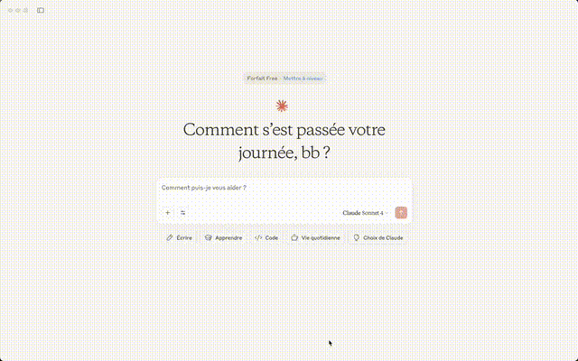

# MCP Server for PyMDU

A Model Control Protocol server that allows Claude Desktop to communicate with PyMDU.

[](https://smithery.ai/server/@rupeelab17/mcp_pymdu)

## Setup

1. Clone the repository
2. Install environment `micromamba env create -f environment.yml`
3. Activate environment `micromamba activate mcp_pymdu`
4. Install poetry `pip install poetry`
5. Install dependencies: `poetry install`

### Using with [Claude Desktop](https://claude.ai/download)



Edit the `claude_desktop_config.json` file with the following content, change path-to-mcp-server to the path of this repo:

```json
{
  "mcpServers": {
    "pymdu": {
      "command": "path-to-python-bin/fastmcp",
      "args": [
        "run",
        "path-to-mcp-server/mcp_pymdu/server.py",
		"--transport",
		"stdio"
      ],
      "env": {
        "PYTHONPATH": "path-to-mcp-server"
      }
    }
  }
}
```

### Using with [Gemini Cli](https://github.com/google-gemini/gemini-cli)


Edit the `~/.gemini/settings.json` file with the following content, change path-to-mcp-server to the path of this repo:

```json
{
  "theme": "Dracula",
  "selectedAuthType": "oauth-personal",
  "preferredEditor": "vim",
  "mcpServers": {
    "pymdu": {
      "command": "path-to-python-bin/fastmcp",
      "args": [
        "run",
        "path-to-mcp-server/mcp_pymdu/server.py",
		"--transport",
		"stdio"
      ],
      "env": {
        "PYTHONPATH": "path-to-mcp-server"
      }
    }
  }
}
```

